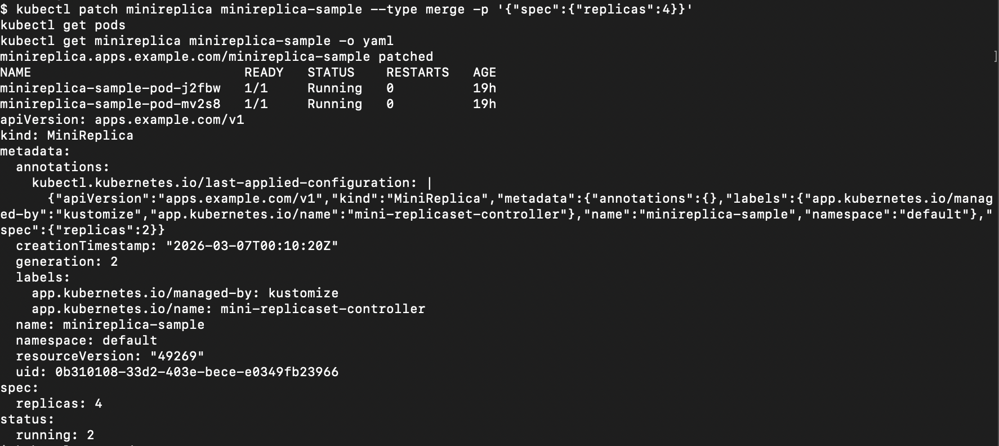
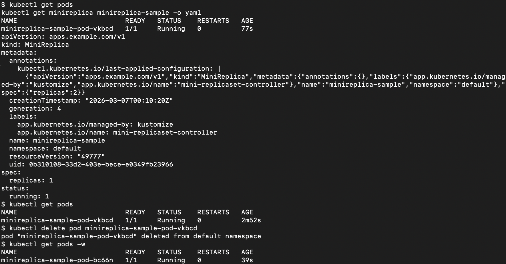

# MiniReplicaSet Controller

## Project Overview

This project implements a simplified ReplicaSet-like controller using Go and controller-runtime.

The controller watches custom `MiniReplica` resources and reconciles the number of Pods in the cluster to match the desired replica count specified in the resource.

This project was built as a learning exercise to understand:
- Kubernetes controllers and the reconcile loop
- desired state vs. actual state
- label-based Pod selection
- owner references
- basic Pod creation and deletion logic

The controller currently supports:

- Watching `MiniReplica` custom resources
- Listing Pods that belong to a `MiniReplica` using labels
- Creating Pods when the actual count is smaller than the desired count
- Deleting extra Pods when the actual count is larger than the desired count
- Setting owner references on created Pods

This is a simplified educational controller and does not implement all behaviors of the built-in Kubernetes ReplicaSet.

This project was bootstrapped with Kubebuilder and extended with a simplified `MiniReplica` controller implementation.

## Custom Resource Example

Example `MiniReplica` resource:

```yaml
apiVersion: apps.example.com/v1
kind: MiniReplica
metadata:
  name: demo
spec:
  replicas: 4 
```

## Reconciliation logic

The controller follows this basic workflow:

1. Read the `MiniReplica` object
2. List Pods in the same namespace with the matching label
3. Compare actual Pod count with desired replica count
4. If actual < desired, create new Pods
5. If actual > desired, delete extra Pods
6. Set owner references so created Pods are managed by the `MiniReplica`

The label used to associate Pods with a `MiniReplica` is:

- `minireplica: <MiniReplica name>`

## Project Structure 

- `api/`  
  Defines the `MiniReplica` API types

- `internal/controller/` or `controllers/`  
  Contains the reconcile logic for the controller

- `config/`  
  Kubernetes manifests generated by Kubebuilder

- `Makefile`  
  Common build, install, and run commands

## How to Run

### Prerequisites

- Go
- Docker
- kind
- kubectl
- Kubebuilder dependencies

### Steps

1. Create a kind cluster: kind create cluster
2. Install the CRD: make install
3. Run the controller: make run
4. Apply a `MiniReplica` resource: kubectl apply -f config/samples/apps_v1_minireplica.yaml
5. Observe Pod creation and reconciliation behavior: kubectl get pods -w

## Validation

The following behaviors were tested manually:

- Create a `MiniReplica` with replicas = 1, 2, and 3
- Increase `spec.replicas` and verify new Pods are created
- Decrease `spec.replicas` and verify extra Pods are deleted
- Delete a managed Pod and verify the controller recreates it

These tests confirm that the controller can reconcile actual Pod count toward the desired state.

## Process
1. scale up process: 
kubectl patch minireplica-sample --type merge -p '{"spec":{"replicas":4}}'
kubectl get pods
kubectl get minireplica minireplica-sample -o yaml

at first:
spec:
  replicas: 4
status:
  running: 2

later:
spec:
  replicas: 4
status:
  running: 4

similarly:
kubectl patch minireplica-sample --type merge -p '{"spec":{"replicas":5}}'
kubectl get pods
kubectl get minireplica minireplica-sample -o yaml

2. scale down process:
kubectl patch minireplica-sample --type merge -p '{"spec":{"replicas":1}}'
kubectl get pods
kubectl get minireplica minireplica-sample -o yaml
spec:
  replicas: 1
status:
  running: 5

later:
spec:
  replicas: 1
status:
  running: 1

3. delete process:
kubectl get pods
kuectl delete pod minireplica-sample-pod-<abc>
kubectl get pods -w

we can see after deleting, the pod's name is different

## Problems and What I Learned

1. I started learning Go only recently, so I still spend some time struggling with the formatting, although there is not too much difficult grammar in this project
2. I often did not know which built-in methods, fields, or helper functions were available in the Kubernetes and controller-runtime libraries. For example, at first I don't know the Get() function, my target is to use the passed-in parameters r and req to get the real object MiniReplicaset. Then, I started by checking the type of `r`, and I find r's type struct and think it may implement the client's method, so I go to see the client function. Finally, I found Get() inside client.
3. At the end of the project, when I was checking if the model can scale down and up normally, I found it couldn't work. The terminal told me the pod had InvalidImageName, so I changed 
"nginx: latest" to "nginx:latest" 
Moreover, I always found the terminal did not show the output I expected, and misunderstood that the terminal was broken, so I added log to record every step of the model 
4. The scaling operation was successful but the status wasn't updated immediately. This taught me that reconciliation is not always reflected immediately in status, and that the controller may need another reconciliation cycle to observe and correct the updated state.

## Demo Screenshots

### Scale up
After increasing `spec.replicas`, the controller created additional Pods.



### Pod recreation
After deleting a managed Pod, the controller created a new Pod to restore the desired state.




## Pod Adoption Logic (Updated by Mar, 15th)

To make the MiniReplica controller closer to the behavior of the official Kubernetes ReplicaSet controller, orphan Pod adoption is added to the reconcile process.

The whole process works as follows:

1. The controller begins a new **Reconcile** loop.
2. It retrieves the current **MiniReplica** object, which provides the key information needed for reconciliation, including:
   - `Name`
   - `Namespace`
   - `UID`
   - `Selector`
   - desired replica count
3. The controller uses the MiniReplica's **selector** to compare against Pod labels.
4. If a Pod matches the selector, it becomes a **candidate Pod**. At this stage, the controller only knows that the Pod may be related to the MiniReplica, but its ownership is not yet confirmed.
5. The controller then checks the Pod's **owner reference** to determine its actual ownership:
   - If the Pod is already owned by the current MiniReplica, no adoption is needed.
   - If the Pod has no controller owner, it is considered an **orphan Pod** and can be adopted.
   - If the Pod is already owned by another controller, it cannot be adopted and is ignored.
6. Only Pods that both:
   - match the selector, and
   - have no controller owner  
   are eligible for adoption.
7. Before performing adoption, the controller should re-check that the MiniReplica still exists and has not been deleted or replaced.
8. Adoption is performed by setting the Pod's ownership to the current MiniReplica, turning the orphan Pod into an **owned Pod**.
9. After all candidate Pods are checked, the controller uses the number of **owned Pods** to compare against the desired replica count.
10. Based on this comparison, the controller can then decide whether it still needs to create or delete Pods.

In short, orphan Pod adoption ensures that existing matching Pods are properly claimed before replica scaling decisions are made.